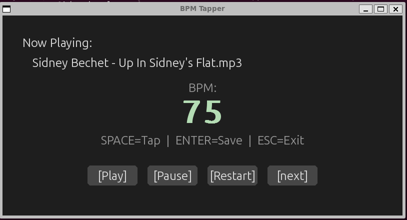

# Music Classifier & Cleaner

Classifies a music library by artist genre (via MusicBrainz), reorganises folders by genre, and taps BPMs for local MP3 collections.

See [CHANGELOG.md](https://github.com/MarcRamos/music-classifier-cleaner/blob/main/CHANGELOG.md) for version history.

## Commands

| Command | Purpose |
|---|---|
| `classify-organize` | Scan library, classify artists by genre via MusicBrainz, reorganise into genre folders |
| `classify-organize --tag-only` | Tag genres and normalize artist names in-place without moving folders |
| `scan-library` | Scan library for artists with few songs, output a CSV for manual review |
| `discover-from-library` | Process the review CSV — remove artist folders or explore top tracks via Deezer |
| `tag-library-genres` | Tag all audio files with top 3 MusicBrainz genres + language tag |
| `archive-download` | Download from archive.org, tap BPM interactively, and organize by BPM range |
| `music-tapper` | Tap BPM for local MP3s in a folder and organize by BPM range |
| `download-ytmusic` | Download audio from YouTube Music playlists as MP3 |

All commands are available system-wide after `pip install -e .`. Alternatively use `poetry run <command>`.

## Configuration

| Variable | Required | Description |
|---|---|---|
| `LASTFM_API_KEY` | No | Last.fm API key — enables Last.fm fallback when MusicBrainz has no data for an artist. Get one at https://www.last.fm/api/account/create |

Set it in your shell profile or pass it inline:

```bash
export LASTFM_API_KEY=your_key_here
# or
LASTFM_API_KEY=your_key_here classify-organize /path
```

---

### `classify-organize` — Classify and organise by genre

Scans the library root for artist folders (any top-level directory that isn't a genre folder), plus loose MP3s without a parent artist folder. For each artist:

1. **Deduplicates** similar folder names using fuzzy matching (e.g. `"Greenday"` → `"Green Day"`)
2. **Renames** the folder to the canonical name, merging if the target already exists
3. **Updates** the `artist` ID3 tag in every MP3 inside the folder to match the canonical name
4. **Queries MusicBrainz** for the artist's genre tags
5. **Classifies** the tags into one of the predefined genre buckets via keyword matching
6. **Moves** the entire artist folder into the matching genre subfolder (or `other/` if nothing matched)

**Last.fm fallback:** If MusicBrainz has no data for an artist, the tool falls back to Last.fm tags. Set the `LASTFM_API_KEY` environment variable to enable this (see [Configuration](#configuration)).

```bash
classify-organize /path/to/music/library
```

**`--tag-only`:** Tag genres and normalize artist names in-place without moving folders into genre directories.

```bash
classify-organize /path/to/music/library --tag-only
```

---

### `scan-library` — Scan for sparse artists

Walks every genre subfolder, counts songs per artist, and writes a CSV of artists with few songs for manual review.

- Skips empty artist folders (prompts to delete them)
- Also checks loose MP3s in the library root (tagged as genre `"root"`)
- Outputs `artists_to_review.csv` in the library root with columns: `artist`, `genre`, `song_count`, `path`, `decision`

```bash
# Default threshold: 4 songs
scan-library /path/to/music/library

# Custom threshold
scan-library /path/to/music/library -t 3
```

After filling in the `decision` column (`remove` or `explore`), process the CSV with `discover-from-library`.

---

### `discover-from-library` — Process review decisions

Reads the CSV produced by `scan-library` and acts on each row:

- **`remove`** — deletes the entire artist folder via `shutil.rmtree`
- **`explore`** — looks up the artist on Deezer and prints their top 5 tracks with durations

```bash
discover-from-library /path/to/artists_to_review.csv
```

---

### `tag-library-genres` — Tag library with genres from MusicBrainz

Recursively walks every `.mp3` and `.flac` file in the library. For each file:

1. **Reads the artist** from the file's metadata (EasyID3 for MP3, FLAC Vorbis comments for FLAC)
2. **Looks up the artist** on MusicBrainz — fetches genre tags and detects language from tags
3. **Verifies the match** — only tags the file if the MusicBrainz matched name matches the file's artist tag (case-insensitive). Skips if they differ (e.g. MusicBrainz returned a different artist)
4. **Writes tags** — up to 3 genre tags and an ISO 639-2 language code
5. **Skips already-tagged** files — checks existing tags before querying or writing

Caches MusicBrainz results per artist so files by the same artist only trigger one API lookup.

**Last.fm fallback:** If MusicBrainz has no genre data for an artist, the tool falls back to Last.fm tags. Set the `LASTFM_API_KEY` environment variable to enable this (see [Configuration](#configuration)). Language detection is not available from Last.fm.

```bash
# Preview only (no files are modified)
tag-library-genres /path/to/music/library -n

# Tag all files
tag-library-genres /path/to/music/library
```

**Tags written:**

| Format | Genre | Language |
|---|---|---|
| MP3 | `TCON` frame — comma-separated string (e.g. `"Swing, Jazz, Big Band"`) | `TLAN` frame — ISO 639-2 code (e.g. `"eng"`) |
| FLAC | Multiple `GENRE` Vorbis comments | `LANGUAGE` Vorbis comment |

---

### `archive-download` — Download from archive.org

Downloads songs from archive.org, measures BPM interactively, and organizes files into BPM-range folders. Files that already have a BPM tag or `[BPM]` in the filename are skipped.

A `processed.csv` is written in the output directory, tracking every downloaded and processed file (artist, title, BPM, filename, archive ID). On subsequent runs, files already present in the CSV are skipped, avoiding duplicate downloads.

```bash
archive-download \
    --text "swing jazz" \
    --artist "count basie" \
    --year-from 1930 \
    --year-to 1945 \
    --out library/
```

---

### `music-tapper` — Tap BPM for local MP3s

Scans a single folder for MP3 files and opens an interactive BPM tapping UI. Files that already have a BPM tag or `[BPM]` in the filename are skipped. Organizes processed files into BPM-range folders (tens: `60s/`, `70s/`, ..., `250s/`).

```bash
music-tapper /path/to/mp3s
music-tapper /path/to/mp3s --out /path/to/output
```

**BPM Tapping Controls:**

| Key / Button | Action |
|---|---|
| `SPACE` | Tap BPM |
| `ENTER` | Save BPM |
| `ESC` | Exit |
| `[Play]` | Play |
| `[Pause]` | Stop |
| `[Restart]` | Restart track |
| `[next]` | Skip track |



Files are renamed to `(BPM) Artist - Title.mp3` and moved into BPM-range folders under the output directory.

---

### `download-ytmusic` — Download from YouTube Music playlists

Downloads audio from YouTube Music playlist URLs and converts to MP3 (320k) via ffmpeg.

```bash
download-ytmusic "https://music.youtube.com/playlist?list=PL..."
download-ytmusic "https://music.youtube.com/playlist?list=PL..." --out /path/to/dir
```

---

## Developing

**Requirements:** Python 3.10+, [Poetry](https://python-poetry.org/docs/#installation), [ffmpeg](https://ffmpeg.org/) (`sudo apt install ffmpeg`), [unzip](https://infozip.sourceforge.net/) (`sudo apt install unzip`), [deno](https://deno.land/) (`curl -fsSL https://deno.land/install.sh | sh` — restart your shell after install), and system libraries for `pygame` (`libsdl2-dev`).

```bash
# Clone and install
git clone https://github.com/MarcRamos/music-classifier-cleaner.git
cd music-classifier-cleaner
poetry install

# Install in editable mode (optional — lets you edit and run commands without reinstalling)
pip install -e .

# Run a command
classify-organize /path/to/music
music-tapper /path/to/mp3s

# Run tests
pytest tests/ -v

# Run with coverage
pytest tests/ --cov=music_classifier --cov-report=term-missing -v
```

When editing, all changes to files under `music_classifier/` take effect immediately (no rebuild needed with `pip install -e .` or `poetry install`).

---

## Running tests

```bash
# Run all tests (135 tests)
pytest tests/ -v

# Run with coverage
pytest tests/ --cov=music_classifier --cov-report=term-missing -v

# Generate HTML coverage report
pytest tests/ --cov=music_classifier --cov-report=html
open htmlcov/index.html
```

## Project structure

```
music-classifier-cleaner/
├── pyproject.toml              # Poetry config + console_scripts entry points
├── README.md
├── CHANGELOG.md
├── music_classifier/           # Installable Python package
│   ├── __init__.py
│   ├── utils.py                # Genre classification, MusicBrainz, tagging, BPM reorganization
│   ├── cli.py                  # CLI entry point functions (argparse)
│   ├── audio.py                # BPM read/write, sanitize, normalize filenames
│   ├── pipeline.py             # Click CLI: archive-download + music-tapper
│   ├── archive.py              # Archive.org search & download
│   ├── bpm_ui.py               # Pygame BPM tapping UI
│   ├── bpm_organizer.py        # BPM range folder mapping (tens: 60s, 70s, ...)
│   ├── csv_store.py            # CSV tracking of processed files
│   └── youtube.py              # YouTube Music playlist downloader
└── tests/
    ├── __init__.py
    ├── test_utils.py           # 95 tests for utils.py
    └── test_tapper.py          # 40 tests for audio, bpm_organizer, csv_store, bpm_ui (135 total)
```
